# Hvordan koble Visual Studio til MySQL for å hente ut data med C#

## Nødvendig programvare for å utføre denne oppgaven
Brukermanualen forventer at dette allerede er installert.

1. Visual Studio (Community)
    - Visual Studio kan lastes ned fra her: [Visual Studio](https://visualstudio.microsoft.com/ "Title")
2. MySQL Workbench og MySQL server
    - Alt dette kan installeres via MySQL installer som man kan finne vi denne linken: [MySQL Installer](https://dev.mysql.com/downloads/installer/#downloads "Title")
3. En database med en tabell som inneholder informasjon som f.eks kontaktpersoner, studentinformasjon eller kundeinformasjon.
    - I denne guiden vil det bli brukt en database som inneholder data om fiktive studenter.
4. MySQL for Visual Studio
    - MySQL for Visual Studio kan du laste ned og installere ved å gå her: [MySQL for Visual Studio](https://dev.mysql.com/downloads/windows/visualstudio/ "Title")
   
## Steg 1: Oppsett av MySQL `Connector/NET`

For at Visual Studio skal kunne koble opp til en MySQL database må man installere `Connector/NET` som er et bibliotek brukt av C# for å koble opp til databaser.

### Installering av MySQL `Connector/NET`

For installering av `Connector/NET` bruker man MySQL installer for å legge til denne delen av programmet.

- Last ned "MySQL installer" fra her: [MySQL Installer](https://dev.mysql.com/downloads/installer/#downloads "Title"). og last ned `Windows (x86, 32-bit), MIS installer` som vis på bildet. 
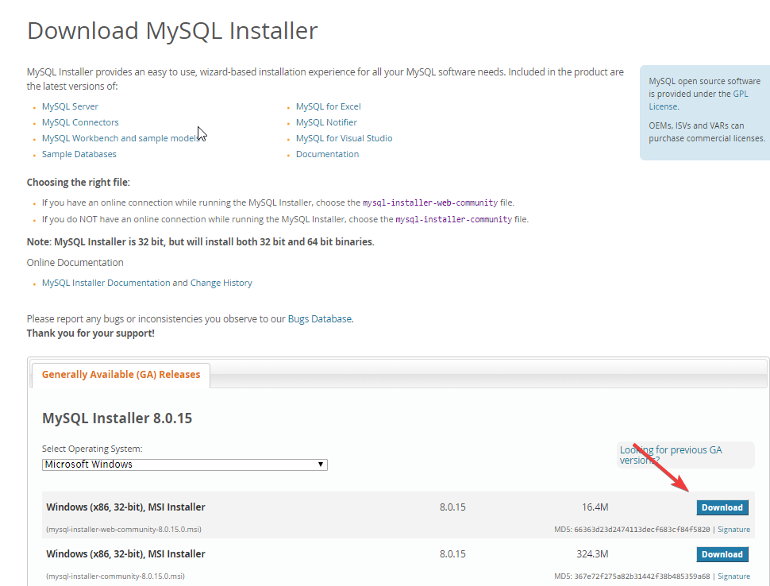

- Hvis du ikke har bruker eller vil registrere deg kan du trykke på `No thanks, just start my download`
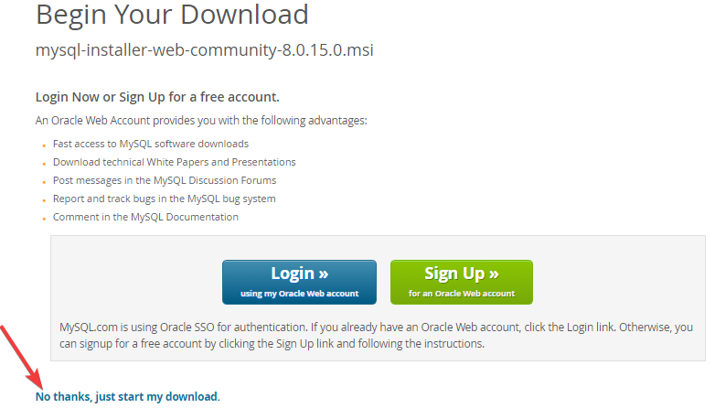

- Når du har åpnet installasjonsfilen, trykk på Add
 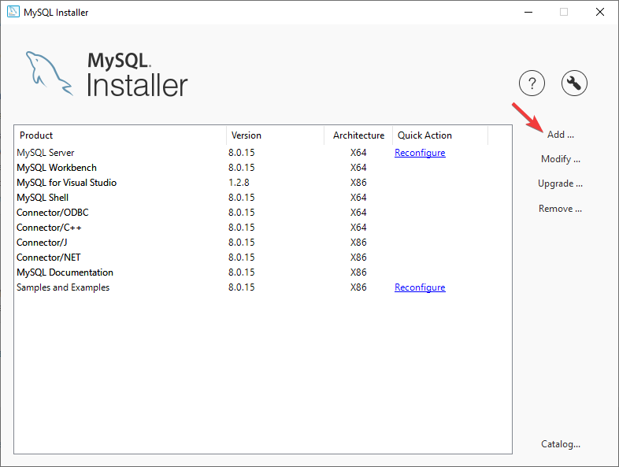

1. Trykk så på `MySQL Connectors > Connector/NET > Connector/NET 8.0 > Connector/NET 8.0.13 - x86` 
2. Trykk så på pilen som på bildet.
  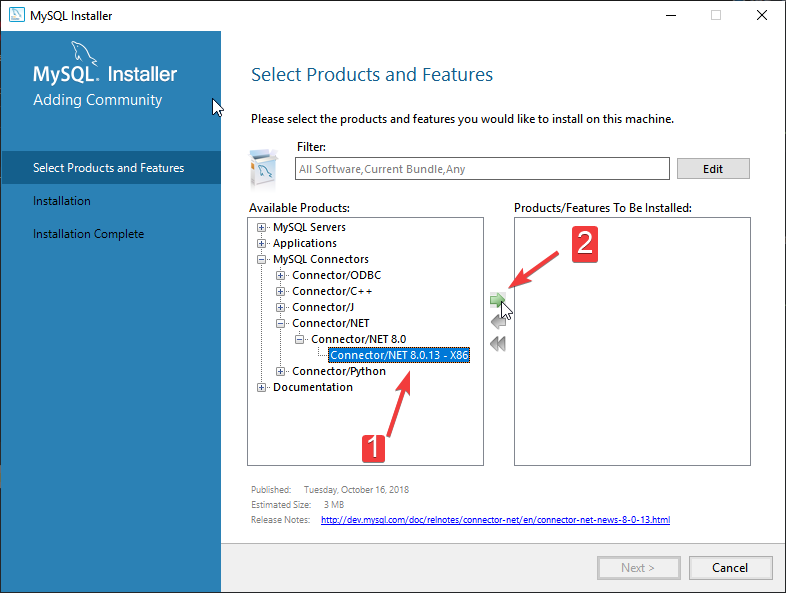
- Trykk på "Next"
- Deretter trykker du på "Execute"
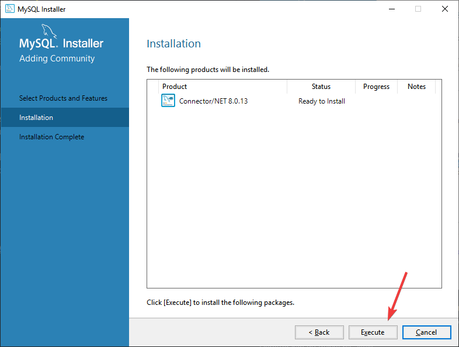

Du har nå installert `Connector/NET` for MySQL og kan fortsette neste steg.

## Steg 2: Opprette prosjektet i Visual Studio

Hvis du ikke allerede har et prosjekt i Visual Studio for å koble deg opp mot MySQL kan du lage et nytt prosjekt.

Her lager jeg et prosjekt som jeg kaller `DatabaseConnection` men prosjektnavn er valgfritt.

For å lage det nye prosjektet gjør du følgende.

- Åpne Visual Studio og så trykk på "Create new project..." som på bildet under.
   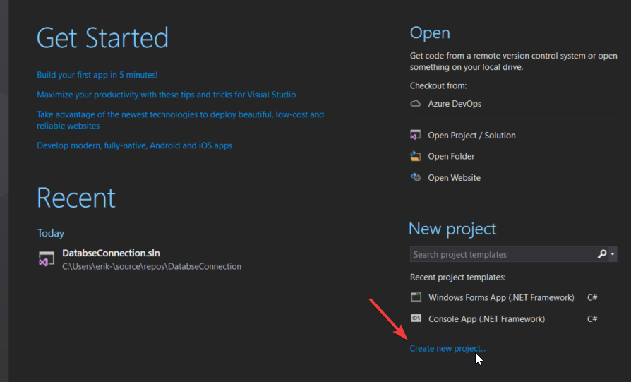
1. Endre navn på prosjektet til et du selv vil ha
2. Velg `Windows Forms APP (.NET Framework)`
3. Trykk på "OK"
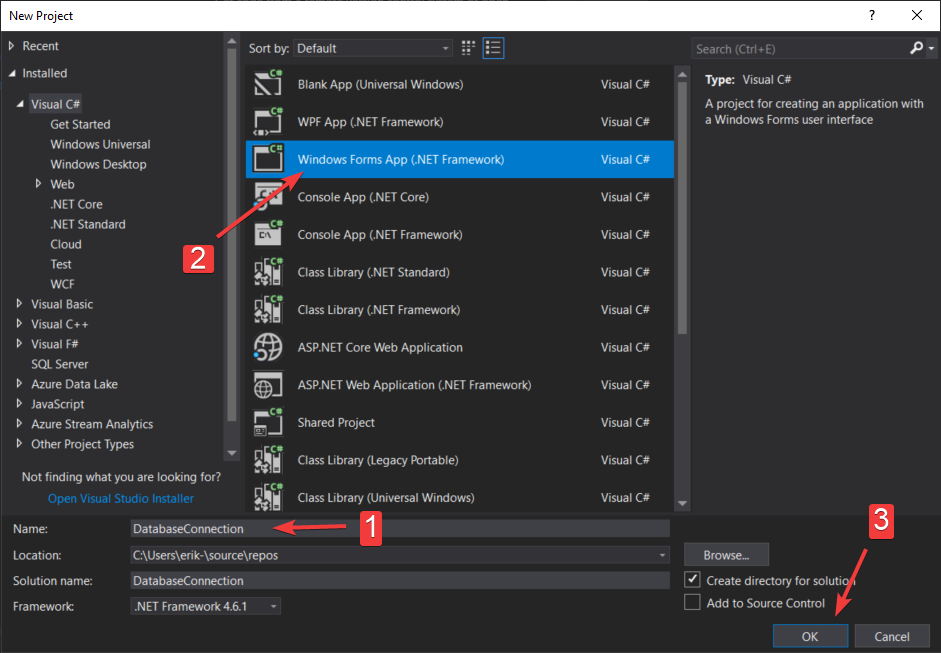

- Legg til `Connector/NET` som referanse

1. Høyreklikk på References
2. "Trykk" på Add reference
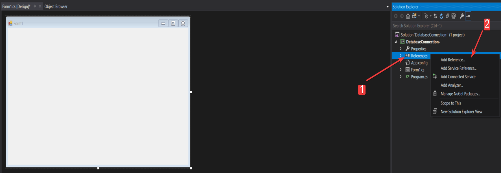

- Søk etter MySQL i søkefeltet og "velg" `MySQL.Data`
- "Trykk" deretter på "OK"
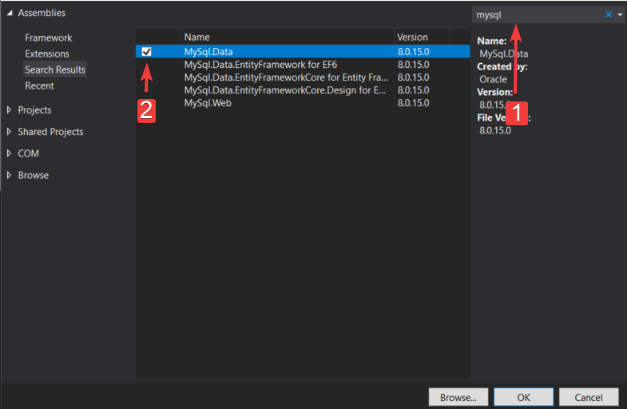

- Opprett en ny `Class`
1. Høyreklikk på navnet på prosjektet ditt under `Solution Explorer`
2. Hold så musepekeren over Add
3. "Trykk" på Class
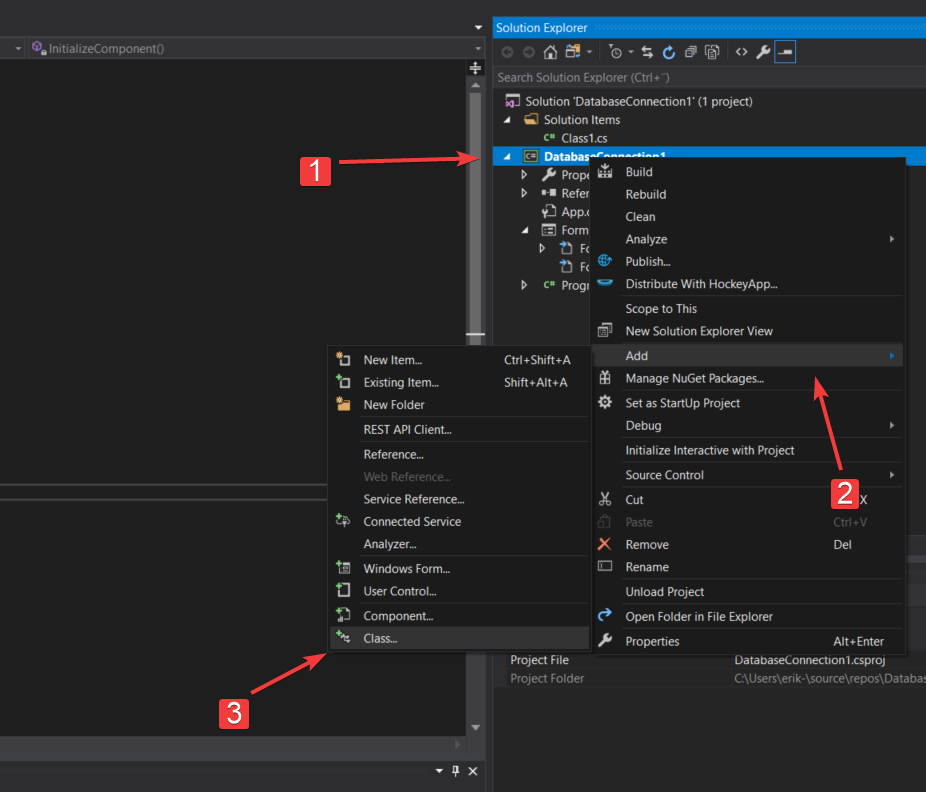

1. "Trykk" på `Class`
2. Endre navn til f.eks `DatabaseConnetion.cs`
3. "Trykk" på  ADD

- Legg til `using MySql.Data.MySqlClient;` og `using System.Data;` som på bildet under
  
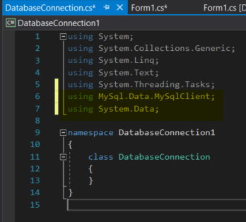

## Koble seg opp mot MySQL database
Etter at referansen til MySQL er lagt til må vi koble oss opp til en database-server

I dette eksempelet vil jeg koble meg opp til en MySQL database som ligger lokalt på min datamaskin. Her vil jeg bruke brukeren root for å gjøre det enkelt for meg selv. Hadde det vært i produksjon ville det blitt laget en egen bruker på MySQL serveren som bare har rettigheter til å lese det som skal hentes ut.

- Oppkobling til database
1. "Trykk" på tools
2. Deretter på `Connect to Database`
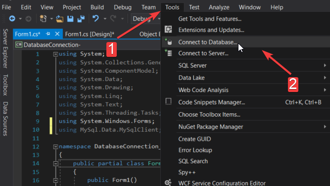

- Legge til koblingen
1. "Trykk" på change og velg `MySQL Databse` og "trykk" OK
2. Skriv inn servernavn, brukernavn og passord. Kryss av for `Save my password`
3. "Trykk så på oppslagsmenyen for velge hvilken database du skal koble deg til.
4. "Trykk så "OK"
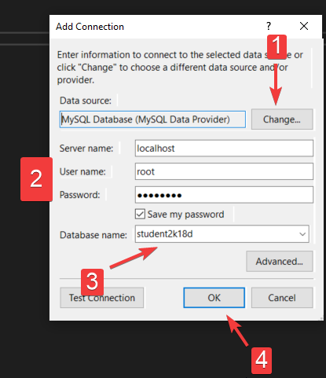

## Kode for å koble seg opp mot databasen

Koden under oppretter en kobling til MySQL databasen. Kommentarene i koden forklarer hva det forskjellige gjør.
	
```c#
using System;
using System.Collections.Generic;
using System.Linq;
using System.Text;
using System.Threading.Tasks;
using MySql.Data.MySqlClient;
using System.Data;

namespace DatabseConnection
{
    class DatabaseConnection
    {
        // Connection string for oppkobling mot databaseserveren
        // "Server=localhost" Brukes for å si hvilken server den skal koble seg mot
        // "user id=root" Sier hvilken bruker du vil skal brukes for oppkoblingen
        // "password=12345678" Passordet til den brukeren du vil skal koble seg opp mot serveren
        // "database=student2k18d" Databasenavnet
        MySqlConnection connectionString = new MySqlConnection("server=localhost;user id=root;password=12345678;database=student2k18d");

        // Åpner tilkoblingen til MySQL serveren og holder tilkoblingen åpen
        public void OpenConnection()
        {
            connectionString.Open();
        }

        // Avslutter tilkoblingen til MySQL serveren
        public void CloseConnection()
        {
            connectionString.Close();
        }

    }
}
```
## Metode for SQL-spørring
For at man skal kunne få noe data ut fra databasen og inn i applikasjonen må det opprettes en metode for spørringen. Denne koden er der for å hente ut data og for å levere den informasjonen til datagridview som vi kommer til i steg 3.

- Under `Closeconnetion` skal det lages en ny `void` med navn `ReadValue`
- Koden skal være som det her og det skal se ut som på bildet
  ```c#
  public DataTable ReadValue()
        {
            DataTable dt = new DataTable();
            MySqlDataAdapter da = new MySqlDataAdapter("Select * from student", connectionString);

            da.Fill(dt);
            return dt;
        }
  ```
  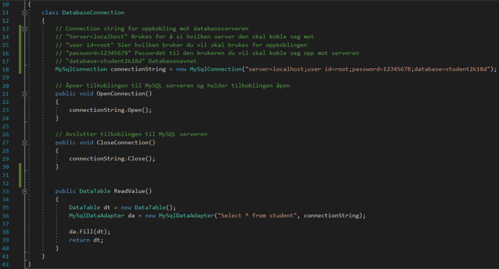
## Steg 3: Lage brukergrensesnittet
Brukergrensesnittet i denne applikasjon skal ha en kanpp som kan trykkes på for å vise innholdet i en tabell i databasen. 

- Gå tilbake til `Form1.cs [Design]*`
- "Trykk" så en gang på Form1 vinduet. Til høyre vil du få opp `Properties.` Finn feltet `Text` under `Appearance` og endre navnet fra Form1 til det du vil, jeg har valgt å kalle den for `DatabaseConnection`
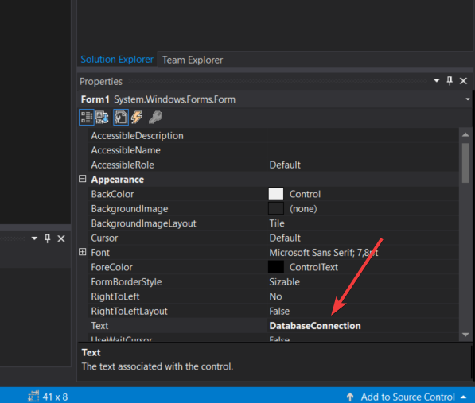

- Sette opp kanpp og vindu for lesing av data

1. "Trykk" på `Toolbox`
2. Søk etter `Button` i søkefeltet
3. Dra `Button` over til formen for å legge det til i applikasjonen
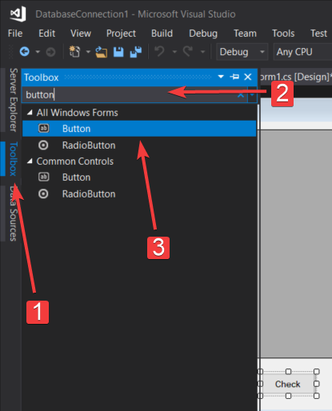

1. Gjør det samme og så søk etter `DataGridView` og dra den over i vinduet også.
   1. Resultatet skal bli slik som på bildet
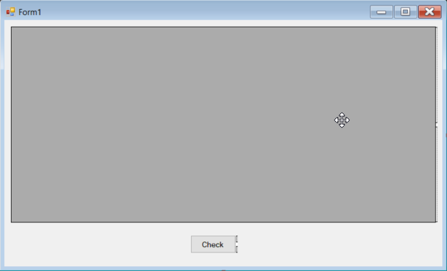

- Trykk på `button1` og så endre navnet på den til `Check` ved å gå under `Properties > text` på høyre side av vinduet.
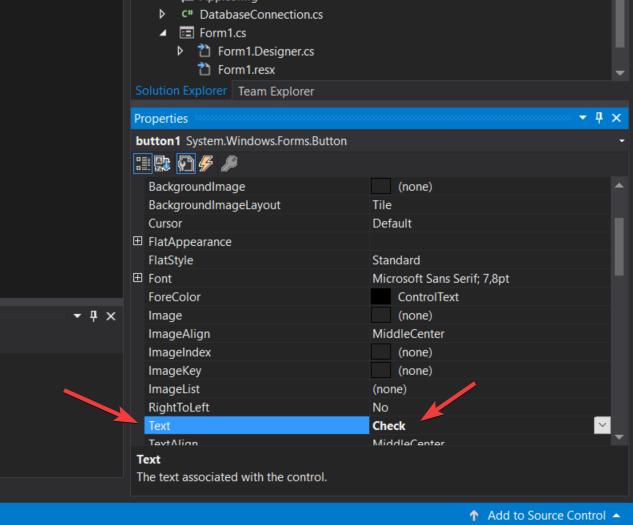

- Dobbelklikk på `Check` knappen og du dukke opp på `Form1.cs` og det vil bli lagt til en ny `private void button1_Click`
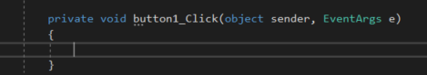

- I denne voiden må vi legge til kode som sier hva som skal skje når knappen trykkes.
- Det som skal skje er
  - Den åpner tilkoblingen til databasen
  - Kjører `metoden DB.ReadValue();`
  - Sender data til datagridview

- Koden ser slik ut
```c#
        private void button1_Click(object sender, EventArgs e)
        {
            DataTable dt = new DataTable();
            DatabaseConnection DB = new DatabaseConnection();

            //Åpner koblingen mot databasen
            DB.OpenConnection();
            //Sier at dt er DB.ReadValue(); som kaller opp metoden for spørringen
            dt = DB.ReadValue();
            //Sier at dataGridView skal vise DB.ReadValue som er en enkel databasespørring "Select * from student"
            dataGridView1.DataSource = dt;
            //Lukker koblingen til databasen
            DB.CloseConnection();
        }
```

## Steg 4: Testing av applikasjon
Du skal nå ha laget en applikasjon som henter ut data fra din egen database. For å sjekke om koden er skrevet riktig vil du kunne se koden som skal ligge i `Form1.cs` og `DatabaseConnetion.cs` under før du går videre.

`Form1.cs`
```c#
using System;
using System.Collections.Generic;
using System.ComponentModel;
using System.Data;
using System.Drawing;
using System.Linq;
using System.Text;
using System.Threading.Tasks;
using System.Windows.Forms;

namespace DatabseConnection
{
    public partial class Form1 : Form
    {
        public Form1()
        {
            InitializeComponent();
        }

        private void button1_Click(object sender, EventArgs e)
        {
            DataTable dt = new DataTable();
            DatabaseConnection DB = new DatabaseConnection();

            //Åpner koblingen mot databasen
            DB.OpenConnection();
            //Sier at dt er DB.ReadValue(); som kaller opp metoden for spørringen
            dt = DB.ReadValue();
            //Sier at dataGridView skal vise DB.ReadValue som er en enkel databasespørring "Select * from student"
            dataGridView1.DataSource = dt;
            //Lukker koblingen til databasen
            DB.CloseConnection();
        }

        private void Form1_Load(object sender, EventArgs e)
        {

        }
    }
}

```
`DatabaseConnetion.cs`
```c#
using System;
using System.Collections.Generic;
using System.Linq;
using System.Text;
using System.Threading.Tasks;
using MySql.Data.MySqlClient;
using System.Data;

namespace DatabseConnection
{
    class DatabaseConnection
    {
        // Connection string for oppkobling mot databaseserveren
        // "Server=localhost" Brukes for å si hvilken server den skal koble seg mot
        // "user id=root" Sier hvilken bruker du vil skal brukes for oppkoblingen
        // "password=12345678" Passordet til den brukeren du vil skal koble seg opp mot serveren
        // "database=student2k18d" Databasenavnet
        MySqlConnection connectionString = new MySqlConnection("server=localhost;user id=root;password=12345678;database=student2k18d");

        // Åpner tilkoblingen til MySQL serveren og holder tilkoblingen åpen
        public void OpenConnection()
        {
            connectionString.Open();
        }

        // Avslutter tilkoblingen til MySQL serveren
        public void CloseConnection()
        {
            connectionString.Close();
        }


        public DataTable ReadValue()
        {
            DataTable dt = new DataTable();
            MySqlDataAdapter da = new MySqlDataAdapter("Select * from student", connectionString);

            da.Fill(dt);
            return dt;
        }
    }
}
```

## Kjør applikasjonen

- Når du nå har sjekket at alt er riktig kan du kjøre applikasjonen ved å "trykke" på `Start`
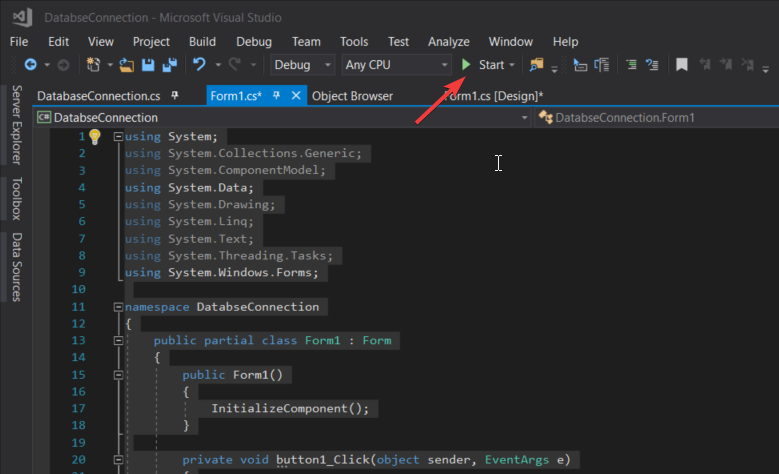

- Etter en liten stund skal dette vinduet dukke opp.
- Trykk så på knappen `Check` og du skal få opp dine data fra tabellen i databasen.
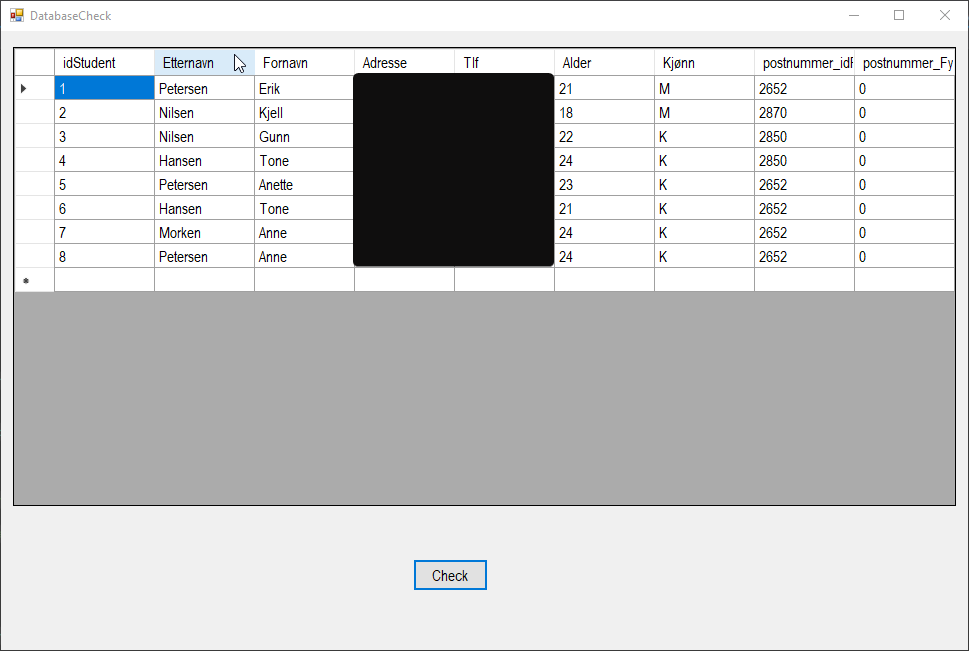
